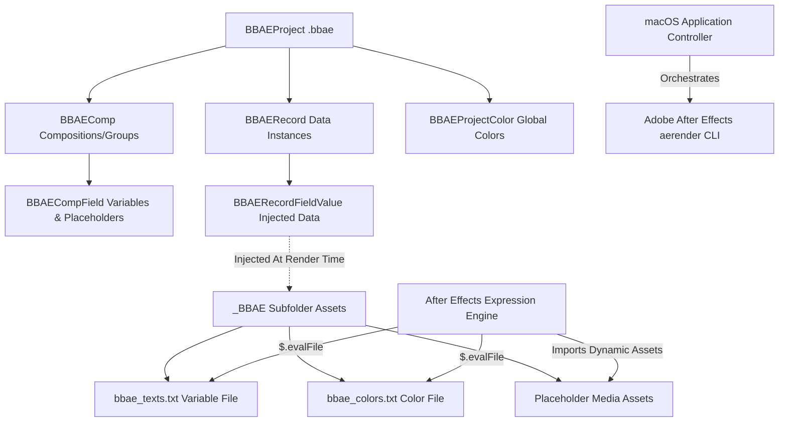

# Batch Buddy AE

Batch Buddy AE is a premium, powerful document-based macOS application designed to automate Adobe After Effects workflows by bridging structured data models with motion graphics composition templates. It allows video editors, graphic designers, and production teams to automate the generation of multiple localized or customized video variations (batch rendering) using After Effects templates.

---

## Architecture Overview

Batch Buddy AE manages data through custom document bundles (with the `.bbae` extension). The document structure leverages a highly modular model-view-controller paradigm designed to parse composition settings, map data values to custom After Effects (AE) scripting environments, and execute high-speed renders using the AE command-line rendering engine (`aerender`).



### Key Conceptual Models

1. **`BBAEProject` (Project Bundle)**: The root node of a `.bbae` document. It manages the references to the Adobe After Effects project file (`.aep`), a list of target After Effects compositions/groups, data records, global color tables, target render folders, and rendering preferences.
2. **`BBAEComp` (Composition / Template)**: Represents a specific composition in the Adobe After Effects project or a composite group of templates. It holds customizable rendering definitions, default output formats, frame-range specifications, custom `.aep` path overrides, and the composition fields schema.
3. **`BBAECompField` (Composition Field)**: Defines a dynamic data channel/variable linked to properties within the After Effects layer hierarchy. Each field specifies a data type (text, long text, numeric value, checkbox status, color fill, image, video, audio, vector AI, or record ID) and holds a variable identifier.
4. **`BBAERecord` (Record Instance)**: A concrete data row containing specific values mapped to each `BBAECompField`.
5. **`BBAERecordFieldValue` (Field Value)**: Represents the specific data content (formatted string, slider value, custom color reference, or local file URL) for a single field in a given record.
6. **`BBAEProjectColor` (Global Colors)**: A managed table of colors mapped to unique identifiers (`bbaeColor_[id]`), allowing central control of brand guidelines across all compositions.

---

## Dynamic Data Injection & Expression Engine

Rather than modifying the After Effects binary file directly, Batch Buddy AE employs a highly efficient **non-destructive file-based injection method**. 

### 1. Data File Preparation
When a render starts, Batch Buddy AE compiles the record values and writes highly optimized, lightweight dynamic JavaScript/ExtendScript configuration files into a designated subfolder (defaults to `_BBAE`) in the `.aep` project's directory:
- **`bbae_texts.txt`**: Contains variable declarations generated from the record's values.
- **`bbae_colors.txt`**: Contains color array definitions from the global color list.
- **Media Asset Directory (`_BBAE/<CompShortName>/`)**: Holds hard-copied or processed media assets required for the active record (e.g. `Placeholder_LowerThird_Profile_Pic.png`).

### 2. Expression Evaluation
Inside Adobe After Effects, layer properties and text layers use native expressions to evaluate these files dynamically during the render process.

#### Text & Sliders (evaluating `bbae_texts.txt`)
Text and slider properties are linked using an expression block that determines the file path relative to the active `.aep` project, executes a `$.evalFile()` lookup, and outputs the value of the matching variable:

```javascript
path = thisProject.fullPath;
pathSplit = path.split("/")
n = pathSplit.length
var aepFilePath = ""
for (i = 0; i < n - 1; i++) {
    aepFilePath += pathSplit[i] + "/";
}
bbaeFilePath = aepFilePath + "_BBAE/bbae_texts.txt";

$.evalFile(bbaeFilePath);
variable_name; // Evaluates to the string or double loaded from the text file
```

#### Color Fills (evaluating `bbae_colors.txt`)
Color properties (e.g., in a Fill Effect) reference global brand colors from `bbae_colors.txt` in a similar manner:

```javascript
path = thisProject.fullPath;
pathSplit = path.split("/")
n = pathSplit.length
var aepFilePath = ""
for (i = 0; i < n - 1; i++) {
    aepFilePath += pathSplit[i] + "/";
}
bbaeFilePath = aepFilePath + "_BBAE/bbae_colors.txt";

$.evalFile(bbaeFilePath);
bbaeColor_id; // Evaluates to a 4-element array [R, G, B, A] mapped to values between 0.0 and 1.0
```

#### Media Placeholders (Images, Videos, Vector Artwork, Audio)
Media files are automated by utilizing "Placeholder" media objects inside the After Effects project. The After Effects template references local assets in the `_BBAE` folder. Before rendering a record, Batch Buddy AE copies the record's specific media assets over these exact placeholders. Thus, After Effects automatically re-links and renders the customized assets without requiring any manual asset swapping.

---

## Batch Rendering & Command-Line Integration

Batch Buddy AE acts as an automation driver that controls Adobe After Effects' native command line renderer (`aerender`) in the background. Understanding how this CLI utility is driven is crucial for integrating or troubleshooting the pipeline.

### Command-Line Arguments & Invocation
When launching a render thread, the application locates the `aerender` executable inside the Adobe After Effects application package and executes a subprocess using macOS system commands. 

The command is structured as follows:

```bash
/Applications/Adobe\ After\ Effects\ <Version>/aerender \
  -project "<Project_Path>" \
  -comp "<Composition_Name>" \
  -output "<Render_Output_Path>" \
  -Rendersettings "<Render_Settings_Template>" \
  -OMtemplate "<Output_Module_Template>" \
  -s <Start_Frame> \
  -e <End_Frame> \
  -reuse
```

#### CLI Parameter Details

| Argument | Format | Type | Description |
| :--- | :--- | :--- | :--- |
| `-project` | Absolute Posix Path | String | Path to the target `.aep` After Effects project file. |
| `-comp` | Composition Name | String | Name of the composition within After Effects to render. |
| `-output` | Absolute Posix Path | String | Path where the rendered media file (e.g., `.mov`, `.mp4`, `.png`) should be saved. |
| `-Rendersettings` | Settings Name | String | Custom After Effects render settings template (e.g., `"Best Settings"`, `"Draft Settings"`). |
| `-OMtemplate` | Module Name | String | After Effects Output Module template (e.g., `"Lossless"`, `"H.264"`, `"PNG Sequence"`). |
| `-s` | Integer Frame Index | Int | (Optional) The specific frame index to start rendering. |
| `-e` | Integer Frame Index | Int | (Optional) The specific frame index to stop rendering. |
| `-reuse` | Flags | None | (Optional) Tells After Effects to reuse an already running background instance of After Effects to decrease startup time. |

### CLI Output & Progress Tracking
The background process returns detailed, live terminal output. Batch Buddy AE captures and parses this console standard output (`stdout`) to feed its dynamic UI progress indicator and statistics model.

#### Sample `aerender` Output Stream:
```text
opt/adobe/aftereffects/aerender version 18.2x42
PROGRESS: 05/26/2026 12:35:10 - Start rendering composition LowerThird_Main.
PROGRESS: 05/26/2026 12:35:11 - Frame 0 successfully rendered. (Time: 0.12s)
PROGRESS: 05/26/2026 12:35:12 - Frame 1 successfully rendered. (Time: 0.11s)
PROGRESS: 05/26/2026 12:35:13 - Frame 2 successfully rendered. (Time: 0.11s)
...
PROGRESS: 05/26/2026 12:35:30 - Frame 150 successfully rendered. (Time: 0.12s)
PROGRESS: 05/26/2026 12:35:31 - Rendering completed successfully.
```

#### Parsing Logic:
1. **Startup Recognition**: Monitors console output for project initialization and composition loading.
2. **Frame Progress**: Rip-grep parses the string `Frame [X] successfully rendered` to calculate the completion percentage:
   $$\text{Percentage} = \frac{\text{Current Frame}}{\text{Supposed Total Frames}} \times 100$$
3. **Speed Metrics**: Analyzes the average time per frame (`(Time: 0.12s)`) to display dynamic rendering stats (e.g., average frame render time and frames per second) in the UI.
4. **Completion/Error Verification**: Intercepts After Effects errors and logs warnings if the `aerender` process terminates with a non-zero exit status.

---

## Core Code & Data Serialization Structure

For developers extending or interfacing with Batch Buddy AE, the following details outline the internal package serialization.

### The `.bbae` JSON Format
The document saves as a structured JSON file under a customized bundle interface. Here is an abbreviated schema mapping:

```json
{
  "id": "A4B7D6C2-E8F9-410A-B3C5-D7E6F8A9B0C1",
  "name": "Promo_Campaign_2026",
  "aeProjectFileUrl": "file:///Users/username/Projects/AE/Promo_Template.aep",
  "renderFolder_": "file:///Users/username/Movies/_BBAE_Render",
  "renderInSubfolders": true,
  "useFullCompNameForSubfolder": false,
  "naming": {
    "globalPrefix": "PROMO",
    "globalMidfix": "",
    "globalSuffix": "V1"
  },
  "templateList": [
    {
      "id": "COMP-9281A",
      "name": "LowerThird_Slide",
      "shortName_": "LT_Slide",
      "defaultRenderSettingId": "Best Settings",
      "defaultOutputModuleId": "Lossless",
      "itemList": [
        {
          "id": "f512b9c3",
          "type": "text",
          "fieldName": "Speaker Name",
          "customVariableName": "speakerName"
        },
        {
          "id": "e228d4fa",
          "type": "colorFill",
          "fieldName": "Background Accent"
        }
      ]
    }
  ],
  "itemInstanceList": [
    {
      "id": "REC-7390",
      "name": "John_Doe_LowerThird",
      "templateId": "COMP-9281A",
      "status": "toBeRendered",
      "instanceItemList": [
        {
          "id": "VAL-1",
          "templateItemId": "f512b9c3",
          "textContent": "John Doe",
          "showAsLargeText": false
        },
        {
          "id": "VAL-2",
          "templateItemId": "e228d4fa",
          "colorId": "COLOR-RED"
        }
      ]
    }
  ],
  "colorList": [
    {
      "id": "COLOR-RED",
      "name": "Brand Red",
      "color": {
        "red": 0.85,
        "green": 0.05,
        "blue": 0.1,
        "alpha": 1.0
      }
    }
  ]
}
```

---

## Developers / Integrators API Calls

If integrating or modifying the rendering scheduler programmatically, the key class-level interfaces are:

### 1. Project Initialization & Save
```swift
// Open a .bbae project from disk
if let project = BBAEProject(url: projectURL) {
    // Registers project and parses compositions
    print("Loaded project: \(project.name)")
}

// Create a new project
let newProject = BBAEProject(url: fileURL, name: "NewCampaign")
newProject.save() // Serializes model structure to disk
```

### 2. Composition Field Definition
```swift
// Add a new dynamic field to a Composition (Template)
let textField = BBAECompField(type: .text, order: 0)
textField.fieldName = "Subtitle Text"
textField.customVariableName = "subText"
comp.addField(textField)

// Re-map record instances to accommodate the new structural changes
project.updateValuesAfterStructureChange()
```

### 3. Record Generation
```swift
// Create a new record instance for a composition template
let record = BBAERecord(comp: targetComp)
record.name = "Variant_A"

// Set values on specific field variables
if let fieldValue = record.getInstance(forTemplateItemId: targetFieldID) {
    fieldValue.textContent = "Summer Sale - 50% Off"
}
project.recordList.append(record)
project.save()
```

### 4. Background Render Execution
```swift
// Triggers the execution queue to process and batch render all records marked as '.toBeRendered'
project.renderItemsNeedingRender { success, errorLog in
    if success {
        print("All variants rendered successfully!")
    } else {
        print("Error log details:\n\(errorLog)")
    }
}
```

---

## Operating Guidelines & Workflows

To implement automation with Batch Buddy AE, adopt the following system workflow:

1. **Composition Analysis**: Design the template in Adobe After Effects. Identify standard properties that need to be variable (text layers, fill colors, opacity switches, numeric values, source footage).
2. **Apply Expressions**: Copy the generated code snippets from Batch Buddy AE and paste them as expressions onto the matching properties in After Effects.
3. **Link Media Assets**: For footage assets, import the placeholder files (e.g. `Placeholder_LT_Slide_Speaker_Pic.png` from the `_BBAE` folder) into the After Effects project. Set up compositions using these assets.
4. **Data Input**: Create a `.bbae` project, link it to the `.aep` template, and define the input schema.
5. **Populate & Render**: Import your data, define your records, select your video files, and hit "Render". Batch Buddy AE handles directory writing, asset copying, expression updates, and After Effects CLI subprocess control automatically.
